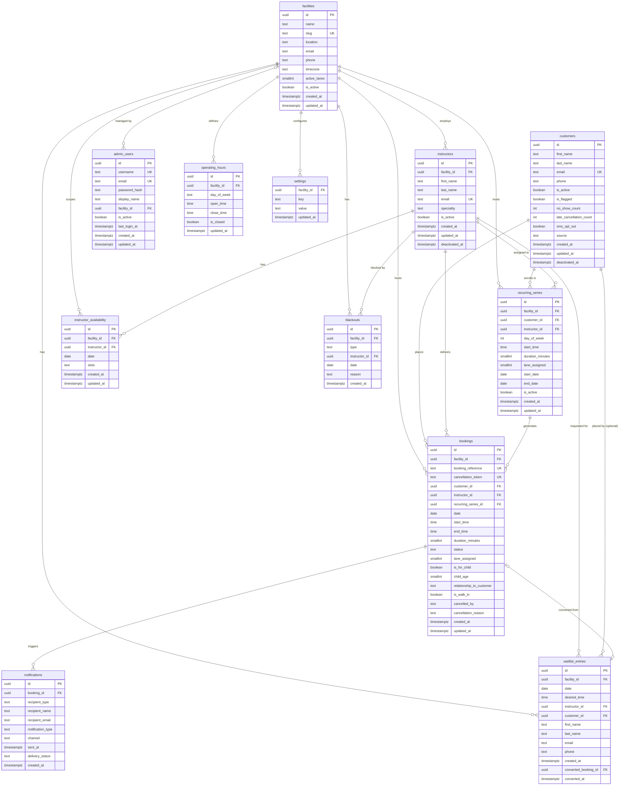

# Data Model Design — Diamond Sports Academy

## Context
The prototype uses flat TypeScript arrays as mock data. This plan designs the production
relational data model for PostgreSQL on NeonDB (serverless). The goal is to capture every
entity, attribute, and relationship from the prototype accurately, close the gaps (e.g. no
explicit recurring series table, no admin user table), and produce a model ready for use
with the Neon serverless HTTP driver and raw SQL or Drizzle ORM.

---

## Key Design Decisions

| Decision | Choice | Rationale |
|---|---|---|
| Primary keys | `UUID` (gen_random_uuid()) | Booking/cancellation tokens exposed to users — GUIDs prevent enumeration |
| Timestamps | `TIMESTAMPTZ` everywhere | NeonDB is UTC; TIMESTAMPTZ stores offset correctly |
| Soft deletes | `deactivated_at TIMESTAMPTZ NULL` | Customers & instructors never hard-deleted (booking history must stay intact) |
| Computed fields | Not stored | `totalSessionsDelivered`, `upcomingSessions` are `COUNT` aggregates on bookings — no drift |
| Denormalized names | Removed from bookings | Prototype stored `customerName`/`instructorName` in Booking for display; production joins |
| Slot arrays | `TEXT[]` (PostgreSQL array) | `instructor_availability.slots` stays as an array of `HH:MM` strings — simple and fast |
| Lane config | `settings` key-value table | Allows admin to change lane count without a schema migration |
| ENUMs | `TEXT` with CHECK constraints | Avoids PostgreSQL ENUM type rigidity; easier to add new values |
| Recurring series | Dedicated table | Prototype used a bare string ID; production needs series-level metadata |
| Multi-facility | `facilities` table + `facility_id FK` on scoped entities | Single schema supports many locations; customers and admin users are global |

---

## ER Diagram



---

## Entity Notes

### `facilities`
- Each row represents one physical location (e.g. "Diamond Sports Academy – Odenton").
- `slug` is a URL-safe identifier used in routing (e.g. `/admin/odenton/...`) — `UNIQUE`.
- `active_lanes` replaces the global `settings('total_active_lanes')` key — lane capacity is inherently per-facility.
- `is_active = false` soft-disables a location without deleting any historical data.
- **Customers are not scoped to a facility** — a customer can book at any location; their history spans all facilities.
- **Admin users**: `facility_id` is nullable. `NULL` = super-admin (cross-facility access); non-NULL = scoped to one location. A future `admin_user_facilities` join table can support multi-facility admins without a schema change.

### `customers`
- `source` values: `online_booking | admin_booking | import`
- `no_show_count` and `late_cancellation_count` can be computed via aggregates, but are stored
  here as denormalized counters (incremented on events) for fast admin dashboard reads without
  a GROUP BY on every page load. Acceptable trade-off.
- `is_flagged` is set manually by admin or automatically when `no_show_count >= 3`.

### `instructors`
- `totalSessionsDelivered` and `upcomingSessions` shown in the prototype UI are **not stored** —
  they are computed: `COUNT(bookings WHERE status='completed')` and
  `COUNT(bookings WHERE status='confirmed' AND date >= TODAY)`.

### `admin_users`
- New table — prototype hardcodes credentials. Production stores bcrypt-hashed passwords.
- Separate from instructors; an instructor is not necessarily an admin user.
- `facility_id NULL` = super-admin (sees all facilities); non-NULL = restricted to one location.

### `recurring_series`
- New table — prototype only had a bare `recurringSeriesId` string on bookings.
- `day_of_week`: 0=Sunday … 6=Saturday (ISO: 1=Monday preferred — choose one convention).
- `end_date NULL` means open-ended series.
- Individual booking cancellations don't affect the series record; only "cancel entire series"
  sets `is_active = false`.

### `bookings`
- `status` CHECK: `IN ('confirmed', 'cancelled', 'no_show', 'completed')`
- `cancelled_by` CHECK: `IN ('customer', 'admin')` — NULL when not cancelled
- `recurring_series_id` is NULL for one-off and walk-in bookings
- `booking_reference` format: `DSA-YYYYMMDD-NNNN` (generated at insert time)
- `cancellation_token` is a random UUID used in the public cancellation URL

### `instructor_availability`
- `slots` is a `TEXT[]` array of `HH:MM` values (e.g., `{'08:00','08:30','09:00'}`)
- One row per instructor per date — `UNIQUE(instructor_id, date)`
- Absence of a row for a date means the instructor is unavailable that day

### `blackouts`
- `type` CHECK: `IN ('facility', 'instructor')`
- `instructor_id` is NULL when `type = 'facility'`
- `facility_id` is always set — a blackout is always scoped to one location

### `waitlist_entries`
- `customer_id` is nullable — a person can join the waitlist before having a customer account
- `first_name`, `last_name`, `email`, `phone` are always populated regardless
- `converted_booking_id` is NULL while the entry is still waiting; set to the created booking's
  UUID when an admin promotes the customer to a confirmed booking
- `converted_at` is stamped at the same time — allows reporting on waitlist-to-booking conversion
  lag and conversion rates by instructor / time period
- Entries are **never deleted** on promotion (audit trail); the UI hides action buttons and
  shows a "Converted" badge once `converted_booking_id` is non-NULL

### `settings`
- Per-facility key-value store for miscellaneous config that doesn't warrant its own column.
- Composite PK: `(facility_id, key)` — same key can exist independently per facility.
- `active_lanes` has moved into `facilities.active_lanes` directly (it's a first-class attribute, not a misc setting).
- Example rows: `(facility_id, 'cancellation_window_hours', '24')`, `(facility_id, 'no_show_grace_minutes', '15')`

---

## Indexes to Add

```sql
-- Bookings: most common query patterns
CREATE INDEX idx_bookings_facility_date      ON bookings(facility_id, date);
CREATE INDEX idx_bookings_customer_id        ON bookings(customer_id);
CREATE INDEX idx_bookings_instructor_id      ON bookings(instructor_id);
CREATE INDEX idx_bookings_status             ON bookings(status);
CREATE INDEX idx_bookings_recurring_series   ON bookings(recurring_series_id);

-- Availability: looked up by facility + instructor + date
CREATE UNIQUE INDEX idx_availability_inst_date
  ON instructor_availability(facility_id, instructor_id, date);

-- Blackouts: looked up by facility + date range
CREATE INDEX idx_blackouts_facility_date     ON blackouts(facility_id, date);

-- Operating hours: one row per facility per day
CREATE UNIQUE INDEX idx_operating_hours_facility_day
  ON operating_hours(facility_id, day_of_week);

-- Waitlist: looked up by facility + date + instructor
CREATE INDEX idx_waitlist_facility_date      ON waitlist_entries(facility_id, date, instructor_id);

-- Notifications: looked up by booking
CREATE INDEX idx_notifications_booking_id   ON notifications(booking_id);

-- Settings: composite PK covers the main lookup; no extra index needed
```

---

## Constraints

```sql
-- Bookings
CHECK (status IN ('confirmed','cancelled','no_show','completed'))
CHECK (cancelled_by IN ('customer','admin'))
CHECK (duration_minutes IN (30, 60))
CHECK (lane_assigned BETWEEN 1 AND 10)  -- upper bound from settings

-- Blackouts
CHECK (type IN ('facility','instructor'))
CHECK (type = 'facility' OR instructor_id IS NOT NULL)

-- Customers
CHECK (source IN ('online_booking','admin_booking','import'))

-- Operating hours
CHECK (day_of_week IN ('Monday','Tuesday','Wednesday','Thursday','Friday','Saturday','Sunday'))
CHECK (is_closed = true OR (open_time IS NOT NULL AND close_time IS NOT NULL))
UNIQUE (facility_id, day_of_week)  -- replaces the old single-column UK on day_of_week
```

---

## What Changes vs. the Prototype

| Prototype field | Production change |
|---|---|
| `Booking.customerName` | Removed — join `customers` |
| `Booking.instructorName` | Removed — join `instructors` |
| `Booking.isRecurring` | Derived: `recurring_series_id IS NOT NULL` |
| `Instructor.totalSessionsDelivered` | Computed aggregate — not stored |
| `Instructor.upcomingSessions` | Computed aggregate — not stored |
| `LANE_CONFIG` object | Moved to `settings` table |
| `LANE_UTILIZATION` snapshot | Computed at query time from `bookings` |
| Hardcoded admin credentials | `admin_users` table with `password_hash` |
| Bare `recurringSeriesId` string | FK → `recurring_series` table |
| `InstructorAvailability.slots` TEXT[] | Kept as-is (PostgreSQL native array) |
| `WaitlistEntry` (no conversion field) | Added `converted_booking_id UUID FK` + `converted_at TIMESTAMPTZ` — entries retained as audit trail |
| Single-facility assumption throughout | Added `facilities` table; `facility_id FK` added to `instructors`, `bookings`, `recurring_series`, `instructor_availability`, `blackouts`, `operating_hours`, `waitlist_entries`, `settings`, `admin_users` — customers remain global |

---

## NeonDB / Driver Notes
- Use `@neondatabase/serverless` HTTP driver for edge/serverless functions (no TCP connection overhead)
- `gen_random_uuid()` is available natively in PostgreSQL 13+ (NeonDB ships 16+) — no extension needed
- Connection pooling is handled by Neon's built-in pooler — no PgBouncer setup required
- For Drizzle ORM: `drizzle-orm/neon-http` adapter works seamlessly with this schema and gives
  full type safety while generating raw SQL (near-zero overhead vs. writing SQL manually)
