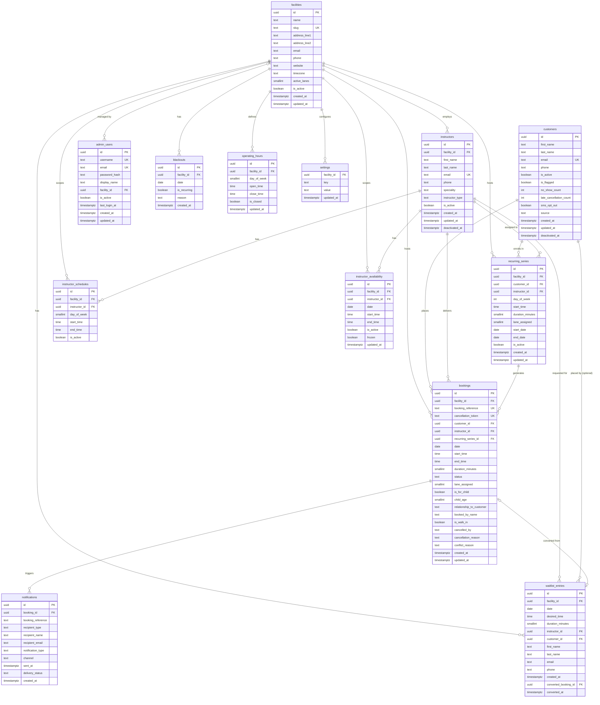

# Data Model Design — Diamond Sports Academy

## Context
The prototype uses flat TypeScript arrays as mock data. This plan designs the production
relational data model for PostgreSQL on NeonDB (serverless). The goal is to capture every
entity, attribute, and relationship from the prototype accurately, close the gaps (e.g. no
explicit recurring series table, no admin user table), and produce a model ready for use
with the Neon serverless HTTP driver and raw SQL or Drizzle ORM.

---

## Key Design Decisions

| Decision | Choice | Rationale |
|---|---|---|
| Primary keys | `UUID` (gen_random_uuid()) | Booking/cancellation tokens exposed to users — GUIDs prevent enumeration |
| Timestamps | `TIMESTAMPTZ` everywhere | NeonDB is UTC; TIMESTAMPTZ stores offset correctly |
| Soft deletes | `deactivated_at TIMESTAMPTZ NULL` | Customers & instructors never hard-deleted (booking history must stay intact) |
| Computed fields | Not stored | `totalSessionsDelivered`, `upcomingSessions` are `COUNT` aggregates on bookings — no drift |
| Denormalized names | Removed from bookings | Prototype stored `customerName`/`instructorName` in Booking for display; production joins |
| Slot arrays | `TEXT[]` (PostgreSQL array) | `instructor_availability.slots` stays as an array of `HH:MM` strings — simple and fast |
| Lane config | `settings` key-value table | Allows admin to change lane count without a schema migration |
| ENUMs | `TEXT` with CHECK constraints | Avoids PostgreSQL ENUM type rigidity; easier to add new values |
| Recurring series | Dedicated table | Prototype used a bare string ID; production needs series-level metadata |
| Multi-facility | `facilities` table + `facility_id FK` on scoped entities | Single schema supports many locations; customers and admin users are global |

---

## ER Diagram


```mermaid
erDiagram

  facilities {
    uuid        id             PK
    text        name
    text        slug           UK
    text        address_line1
    text        address_line2
    text        email
    text        phone
    text        website
    text        timezone
    smallint    active_lanes
    boolean     is_active
    timestamptz created_at
    timestamptz updated_at
  }

  customers {
    uuid        id                     PK
    text        first_name
    text        last_name
    text        email                  UK
    text        phone
    boolean     is_active
    boolean     is_flagged
    int         no_show_count
    int         late_cancellation_count
    boolean     sms_opt_out
    text        source
    timestamptz created_at
    timestamptz updated_at
    timestamptz deactivated_at
  }

  instructors {
    uuid        id                     PK
    uuid        facility_id            FK
    text        first_name
    text        last_name
    text        email                  UK
    text        phone
    text        speciality
    text        instructor_type
    boolean     is_active
    timestamptz created_at
    timestamptz updated_at
    timestamptz deactivated_at
  }

  admin_users {
    uuid        id                     PK
    text        username               UK
    text        email                  UK
    text        password_hash
    text        display_name
    uuid        facility_id            FK
    boolean     is_active
    timestamptz last_login_at
    timestamptz created_at
    timestamptz updated_at
  }

  recurring_series {
    uuid        id                     PK
    uuid        facility_id            FK
    uuid        customer_id            FK
    uuid        instructor_id          FK
    int         day_of_week
    time        start_time
    smallint    duration_minutes
    smallint    lane_assigned
    date        start_date
    date        end_date
    boolean     is_active
    timestamptz created_at
    timestamptz updated_at
  }

  bookings {
    uuid        id                     PK
    uuid        facility_id            FK
    text        booking_reference      UK
    text        cancellation_token     UK
    uuid        customer_id            FK
    uuid        instructor_id          FK
    uuid        recurring_series_id    FK
    date        date
    time        start_time
    time        end_time
    smallint    duration_minutes
    text        status
    smallint    lane_assigned
    boolean     is_for_child
    smallint    child_age
    text        relationship_to_customer
    text        booked_by_name
    boolean     is_walk_in
    text        cancelled_by
    text        cancellation_reason
    text        conflict_reason
    timestamptz created_at
    timestamptz updated_at
  }

  instructor_schedules {
    uuid        id                     PK
    uuid        facility_id            FK
    uuid        instructor_id          FK
    smallint    day_of_week
    time        start_time
    time        end_time
    boolean     is_active
  }

  instructor_availability {
    uuid        id                     PK
    uuid        facility_id            FK
    uuid        instructor_id          FK
    date        date
    time        start_time
    time        end_time
    boolean     is_active
    boolean     frozen
    timestamptz updated_at
  }

  blackouts {
    uuid        id                     PK
    uuid        facility_id            FK
    date        date
    boolean     is_recurring
    text        reason
    timestamptz created_at
  }

  operating_hours {
    uuid        id                     PK
    uuid        facility_id            FK
    smallint    day_of_week
    time        open_time
    time        close_time
    boolean     is_closed
    timestamptz updated_at
  }

  waitlist_entries {
    uuid        id                     PK
    uuid        facility_id            FK
    date        date
    time        desired_time
    smallint    duration_minutes
    uuid        instructor_id          FK
    uuid        customer_id            FK
    text        first_name
    text        last_name
    text        email
    text        phone
    timestamptz created_at
    uuid        converted_booking_id   FK
    timestamptz converted_at
  }

  notifications {
    uuid        id                     PK
    uuid        booking_id             FK
    text        booking_reference
    text        recipient_type
    text        recipient_name
    text        recipient_email
    text        notification_type
    text        channel
    timestamptz sent_at
    text        delivery_status
    timestamptz created_at
  }

  settings {
    uuid        facility_id            FK
    text        key
    text        value
    timestamptz updated_at
  }

  %% Relationships
  facilities        ||--o{ instructors           : "employs"
  facilities        ||--o{ bookings              : "hosts"
  facilities        ||--o{ recurring_series      : "hosts"
  facilities        ||--o{ instructor_schedules   : "scopes"
  facilities        ||--o{ instructor_availability : "scopes"
  facilities        ||--o{ blackouts             : "has"
  facilities        ||--o{ operating_hours       : "defines"
  facilities        ||--o{ waitlist_entries      : "has"
  facilities        ||--o{ settings              : "configures"
  facilities        |o--o{ admin_users           : "managed by"
  customers         ||--o{ bookings              : "places"
  instructors       ||--o{ bookings              : "delivers"
  recurring_series  ||--o{ bookings              : "generates"
  customers         ||--o{ recurring_series      : "enrolls in"
  instructors       ||--o{ recurring_series      : "assigned to"
  bookings          ||--o{ notifications         : "triggers"
  instructors       ||--o{ instructor_schedules   : "has"
  instructors       ||--o{ instructor_availability : "has"
  instructors       ||--o{ waitlist_entries      : "requested for"
  customers         ||--o{ waitlist_entries      : "placed by (optional)"
  bookings          |o--o| waitlist_entries      : "converted from"
```

---

## Entity Notes

### `facilities`
- Each row represents one physical location (e.g. "Diamond Sports Academy – Odenton").
- `slug` is a URL-safe identifier used in routing (e.g. `/admin/odenton/...`) — `UNIQUE`.
- `active_lanes` replaces the global `settings('total_active_lanes')` key — lane capacity is inherently per-facility.
- `address_line1` / `address_line2` replace the prototype's single `location` field (e.g. "8274 Lokus Rd" / "Odenton, MD 21113").
- `website` stores the public-facing URL (e.g. `https://thediamondsportsacademy.com`).
- `phone` stores the display form (e.g. "(443) 865-1639"). The `phoneHref` field in the prototype (`tel:+14438651639`) is **derived** — computed at render time from the `phone` value; not stored.
- `is_active = false` soft-disables a location without deleting any historical data.
- **Customers are not scoped to a facility** — a customer can book at any location; their history spans all facilities.
- **Admin users**: `facility_id` is nullable. `NULL` = super-admin (cross-facility access); non-NULL = scoped to one location. A future `admin_user_facilities` join table can support multi-facility admins without a schema change.

### `customers`
- `source` values: `online_booking | admin_booking | import`
- `no_show_count` and `late_cancellation_count` can be computed via aggregates, but are stored
  here as denormalized counters (incremented on events) for fast admin dashboard reads without
  a GROUP BY on every page load. Acceptable trade-off.
- `is_flagged` is set manually by admin or automatically when `no_show_count >= 3`.

### `instructors`
- `phone` stores the instructor's contact number. Optional (some instructors may not have one on file).
- `instructor_type` CHECK: `IN ('lane', 'non_lane')`. Required — no default. (Enhancement from prototype work.)
  - `lane`: consumes a physical batting lane; `lane_assigned` is set on their bookings.
  - `non_lane`: e.g. speed/agility or conditioning coaches who work off the lanes; `lane_assigned = NULL` on their bookings and lane-full checks do not apply.
- The prototype has a `type` field (display label e.g. "Lane Instructor") separate from `instructor_type` ("lane"). In production, `type` is **dropped** — the display label is derived from `instructor_type` at render time.
- `totalSessionsDelivered` and `upcomingSessions` shown in the prototype UI are **not stored** —
  they are computed: `COUNT(bookings WHERE status='completed')` and
  `COUNT(bookings WHERE status='confirmed' AND date >= TODAY)`.

### `admin_users`
- New table — prototype hardcodes credentials. Production stores bcrypt-hashed passwords.
- Separate from instructors; an instructor is not necessarily an admin user.
- `facility_id NULL` = super-admin (sees all facilities); non-NULL = restricted to one location.

### `recurring_series`
- New table — prototype only had a bare `recurringSeriesId` string on bookings.
- `day_of_week`: 0=Sunday … 6=Saturday (ISO: 1=Monday preferred — choose one convention).
- `end_date NULL` means open-ended series.
- Individual booking cancellations don't affect the series record; only "cancel entire series"
  sets `is_active = false`.

### `bookings`
- `status` CHECK: `IN ('confirmed', 'cancelled', 'no_show', 'completed', 'waitlisted')`
  - `waitlisted`: booking exists but is held pending slot confirmation — used for recurring series sessions where an instructor conflict exists on a specific week
- `cancelled_by` CHECK: `IN ('customer', 'admin')` — NULL when not cancelled
- `conflict_reason` CHECK: `IN ('instructor_conflict', 'lane_at_capacity')` — NULL unless `status = 'waitlisted'`. Records why the booking could not be immediately confirmed.
- `booked_by_name` stores the name of the person who made the booking when different from the participant (e.g. a parent booking for a child but not captured in `relationship_to_customer`). NULL for self-bookings.
- `recurring_series_id` is NULL for one-off and walk-in bookings
- `booking_reference` format: `DSA-YYYY-NNNNN` (sequential within year, generated at insert time)
- `cancellation_token` is a random UUID used in the public cancellation URL

### `instructor_availability`
- **Updated from prototype work:** The prototype revealed two distinct availability structures that must both exist:
  1. **`instructor_schedules`** — recurring weekly template (one row per instructor per day-of-week). Acts as fallback when no date-specific override exists.
  2. **`instructor_availability`** — date-specific overrides. Takes full precedence over the weekly template for a given date.
- `slots` computed (not stored): derive 30-min intervals from `start_time` to `end_time` at query time using `generate_series`.
- **Critical constraint (from bug):** `is_active = true` with a null `start_time` or `end_time` is invalid. The prototype produced a broken "?" display for this state. Must be enforced with a CHECK constraint: `CHECK ((is_active = false) OR (start_time IS NOT NULL AND end_time IS NOT NULL AND end_time > start_time))`.
- `frozen = true` blocks normal admin edits — requires explicit override.
- One row per instructor per date — `UNIQUE(instructor_id, date)`.
- Saturday availability must be validated against Saturday facility hours (09:00–17:00), not weekday hours.

#### Revised `instructor_schedules` table (new — replaces `recurring` nested object)

| Column | Type | Notes |
|---|---|---|
| `id` | `UUID` PK | |
| `facility_id` | `UUID` FK | |
| `instructor_id` | `UUID` FK | |
| `day_of_week` | `SMALLINT` | 0=Sun … 6=Sat |
| `start_time` | `TIME` | NULL when is_active = false |
| `end_time` | `TIME` | NULL when is_active = false |
| `is_active` | `BOOLEAN` DEFAULT false | |

```sql
ALTER TABLE instructor_schedules
  ADD CONSTRAINT valid_dow CHECK (day_of_week BETWEEN 0 AND 6),
  ADD CONSTRAINT valid_active_times CHECK (
    (is_active = false) OR
    (start_time IS NOT NULL AND end_time IS NOT NULL AND end_time > start_time)
  ),
  ADD CONSTRAINT unique_instructor_dow UNIQUE (facility_id, instructor_id, day_of_week);
```

#### Revised `instructor_availability` table (date-specific overrides)

| Column | Type | Notes |
|---|---|---|
| `id` | `UUID` PK | |
| `facility_id` | `UUID` FK | |
| `instructor_id` | `UUID` FK | |
| `date` | `DATE` | |
| `start_time` | `TIME` | NULL when is_active = false |
| `end_time` | `TIME` | NULL when is_active = false |
| `is_active` | `BOOLEAN` DEFAULT true | false = explicitly unavailable this date |
| `frozen` | `BOOLEAN` DEFAULT false | |
| `updated_at` | `TIMESTAMPTZ` | |

```sql
ALTER TABLE instructor_availability
  ADD CONSTRAINT valid_active_times CHECK (
    (is_active = false) OR
    (start_time IS NOT NULL AND end_time IS NOT NULL AND end_time > start_time)
  ),
  ADD CONSTRAINT unique_instructor_date UNIQUE (facility_id, instructor_id, date);
```

### `blackouts`
- **Updated from prototype work:** Instructor-specific blackouts were removed. Instructor unavailability is handled via `instructor_availability` (set `is_active = false` for that date). Blackouts are facility-wide only.
- Remove `type` and `instructor_id` columns from earlier design.
- Replace `type` field with `is_recurring BOOLEAN`: `false` = exact date match; `true` = match MM-DD across any year.
- **Yearly recurring match logic:** `EXTRACT(MONTH FROM bl.date) = EXTRACT(MONTH FROM candidate_date) AND EXTRACT(DAY FROM bl.date) = EXTRACT(DAY FROM candidate_date)`.
- **Blackout offset rule (from bug):** When computing "N days from today" for seed or default blackouts, skip Sundays (and any `is_closed` day). Enforce this in the API/seed logic, not as a DB constraint.

#### Revised `blackouts` table

| Column | Type | Notes |
|---|---|---|
| `id` | `UUID` PK | |
| `facility_id` | `UUID` FK | |
| `date` | `DATE` | For recurring: only MM-DD is used for matching |
| `is_recurring` | `BOOLEAN` DEFAULT false | true = yearly recurring (MM-DD match) |
| `reason` | `TEXT` NOT NULL | |
| `created_at` | `TIMESTAMPTZ` | |

### `waitlist_entries`
- `customer_id` is nullable — a person can join the waitlist before having a customer account
- `first_name`, `last_name`, `email`, `phone` are always populated regardless
- `duration_minutes` (30 or 60) is captured when the customer joins the waitlist so admin can
  promote them to a correctly-sized booking without asking again
- `converted_booking_id` is NULL while the entry is still waiting; set to the created booking's
  UUID when an admin promotes the customer to a confirmed booking
- `converted_at` is stamped at the same time — allows reporting on waitlist-to-booking conversion
  lag and conversion rates by instructor / time period
- Entries are **deleted** on promotion (not retained); the admin waitlist page removes the row
  immediately and shows a success modal with the new booking reference

### `settings`
- Per-facility key-value store for miscellaneous config that doesn't warrant its own column.
- Composite PK: `(facility_id, key)` — same key can exist independently per facility.
- `active_lanes` has moved into `facilities.active_lanes` directly (it's a first-class attribute, not a misc setting).
- Example rows: `(facility_id, 'cancellation_window_hours', '24')`, `(facility_id, 'no_show_grace_minutes', '15')`

---

## Indexes to Add

```sql
-- Bookings: most common query patterns
CREATE INDEX idx_bookings_facility_date      ON bookings(facility_id, date);
CREATE INDEX idx_bookings_customer_id        ON bookings(customer_id);
CREATE INDEX idx_bookings_instructor_id      ON bookings(instructor_id);
CREATE INDEX idx_bookings_status             ON bookings(status);
CREATE INDEX idx_bookings_recurring_series   ON bookings(recurring_series_id);

-- Availability: looked up by facility + instructor + date
CREATE UNIQUE INDEX idx_availability_inst_date
  ON instructor_availability(facility_id, instructor_id, date);

-- Blackouts: looked up by facility + date range
CREATE INDEX idx_blackouts_facility_date     ON blackouts(facility_id, date);

-- Operating hours: one row per facility per day
CREATE UNIQUE INDEX idx_operating_hours_facility_day
  ON operating_hours(facility_id, day_of_week);

-- Waitlist: looked up by facility + date + instructor
CREATE INDEX idx_waitlist_facility_date      ON waitlist_entries(facility_id, date, instructor_id);

-- Notifications: looked up by booking
CREATE INDEX idx_notifications_booking_id   ON notifications(booking_id);

-- Settings: composite PK covers the main lookup; no extra index needed
```

---

## Constraints

```sql
-- Bookings
CHECK (status IN ('confirmed','cancelled','no_show','completed','waitlisted'))
CHECK (cancelled_by IN ('customer','admin'))
CHECK (conflict_reason IN ('instructor_conflict','lane_at_capacity'))
CHECK (duration_minutes IN (30, 60))
CHECK (lane_assigned BETWEEN 1 AND 10)  -- upper bound from facilities.active_lanes

-- Instructors
CHECK (instructor_type IN ('lane', 'non_lane'))

-- Customers
CHECK (source IN ('online_booking','admin_booking','import'))

-- Notifications
CHECK (notification_type IN ('confirmation','reminder_24hr','reminder_2hr_sms','change','cancellation','calendar_invite'))
CHECK (channel IN ('email','sms','calendar'))
CHECK (delivery_status IN ('sent','pending','failed'))
CHECK (recipient_type IN ('customer','instructor','admin'))

-- Operating hours
-- Note: prototype stores day_of_week as TEXT ("Monday"…"Sunday"); production uses SMALLINT (0=Sun…6=Sat)
CHECK (day_of_week BETWEEN 0 AND 6)
CHECK (is_closed = true OR (open_time IS NOT NULL AND close_time IS NOT NULL AND close_time > open_time))
UNIQUE (facility_id, day_of_week)

-- instructor_schedules
CHECK (day_of_week BETWEEN 0 AND 6)
CHECK ((is_active = false) OR (start_time IS NOT NULL AND end_time IS NOT NULL AND end_time > start_time))
UNIQUE (facility_id, instructor_id, day_of_week)

-- instructor_availability (date-specific overrides)
CHECK ((is_active = false) OR (start_time IS NOT NULL AND end_time IS NOT NULL AND end_time > start_time))
UNIQUE (facility_id, instructor_id, date)
```

---

## What Changes vs. the Prototype

| Prototype field | Production change |
|---|---|
| `Booking.customerName` | Removed — join `customers` |
| `Booking.instructorName` | Removed — join `instructors` |
| `Booking.isRecurring` | Derived: `recurring_series_id IS NOT NULL` |
| `Instructor.totalSessionsDelivered` | Computed aggregate — not stored |
| `Instructor.upcomingSessions` | Computed aggregate — not stored |
| `LANE_CONFIG` object | Moved to `settings` table |
| `LANE_UTILIZATION` snapshot | Computed at query time from `bookings` |
| Hardcoded admin credentials | `admin_users` table with `password_hash` |
| Bare `recurringSeriesId` string | FK → `recurring_series` table |
| `InstructorAvailability.slots` TEXT[] | **Removed.** Slots computed at query time via `generate_series(start_time, end_time - interval '30 min', interval '30 min')`. |
| `instructor_availability` (single table, slots stored) | **Split into two tables:** `instructor_schedules` (recurring weekly template, one row per DOW) + `instructor_availability` (date-specific overrides). Both have `start_time`/`end_time` + `is_active` + CHECK constraint that forbids `is_active=true` with null times. |
| `blackouts.type IN ('facility','instructor')` + `instructor_id` | **Removed.** Instructor-specific unavailability uses `instructor_availability (is_active=false)`. Blackouts are facility-wide only. Replaced `type` with `is_recurring BOOLEAN`. |
| No `instructor_type` field | Added `instructor_type TEXT CHECK IN ('lane','non_lane')` to `instructors`. Non-lane bookings skip lane-capacity checks and do not set `lane_assigned`. |
| Saturday closed by default | **Changed.** `operating_hours` seed: Saturday `is_closed=false, open_time='09:00', close_time='17:00'`. Sunday remains closed. |
| `WaitlistEntry` (no `durationMinutes`) | Added `duration_minutes SMALLINT` — captured at waitlist sign-up so admin can promote to correct session length |
| `WaitlistEntry.convertedBookingId` — entries retained in prototype | In production DB, `converted_booking_id` + `converted_at` retained for audit/reporting; prototype deletes on promotion |
| `Booking.status` missing `waitlisted` | Added `'waitlisted'` to status CHECK — used for recurring series sessions with instructor conflict |
| No `Booking.conflictReason` | Added `conflict_reason TEXT CHECK IN ('instructor_conflict','lane_at_capacity')` — NULL unless waitlisted |
| No `Booking.bookedByName` | Added `booked_by_name TEXT NULL` — captures who made the booking when different from participant |
| `Instructor.type` (display label, redundant) | Dropped — derived from `instructor_type` at render time |
| `Instructor` missing `phone` | Added `phone TEXT` to `instructors` table |
| `FacilitySettings.location` (single field) | Split into `address_line1` + `address_line2` |
| `FacilitySettings` missing `website` | Added `website TEXT` to `facilities` table |
| `FacilitySettings.phoneHref` | **Derived** — computed from `phone` at render time; not stored |
| `NotificationRecord.bookingReference` (denormalized) | Retained in production for display convenience (avoids join on every notification list load); acceptable denormalization |
| `operating_hours.day_of_week` as TEXT ("Monday") | Production uses `SMALLINT` (0=Sun…6=Sat) — consistent with `instructor_schedules` |
| Single-facility assumption throughout | Added `facilities` table; `facility_id FK` added to `instructors`, `bookings`, `recurring_series`, `instructor_availability`, `blackouts`, `operating_hours`, `waitlist_entries`, `settings`, `admin_users` — customers remain global |

---

## NeonDB / Driver Notes
- Use `@neondatabase/serverless` HTTP driver for edge/serverless functions (no TCP connection overhead)
- `gen_random_uuid()` is available natively in PostgreSQL 13+ (NeonDB ships 16+) — no extension needed
- Connection pooling is handled by Neon's built-in pooler — no PgBouncer setup required
- For Drizzle ORM: `drizzle-orm/neon-http` adapter works seamlessly with this schema and gives
  full type safety while generating raw SQL (near-zero overhead vs. writing SQL manually)
